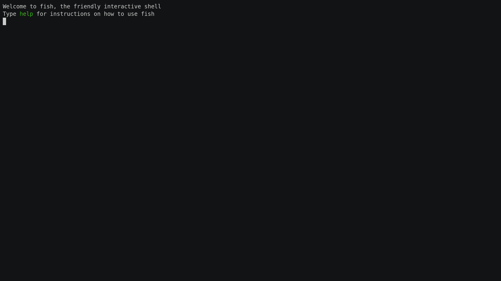

# ddg
duckduckgo terminal search for use with fzf (or grep)


# What?

With this tool you can search for anything on duckduckgo.com and further filter the results with fzf or grep.

## Instalation 

with go tool:

```bash
go install github.com/cauefcr/ddg@latest
```

from source:

```bash
git clone https://github.com/cauefcr/ddg
cd ddg
go install .
```

## Usage

```bash
ddg [search] | grep [filter]
ddg [search] | fzf
ddg [search] | grep [filter] | fzf
```

## Show it to me in action

